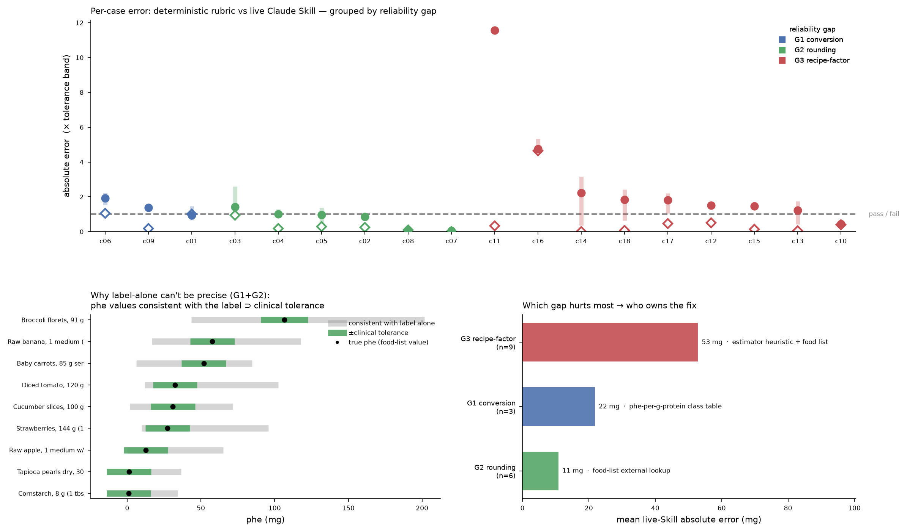

# Where phe-estimator reliability actually breaks, and the ask to the Claude Community

*The reliability problem, decomposed into four named, independently improvable, benchmark measured gaps.*

PKU families already use AI phe-estimator apps, because the alternative is nothing. A bloom of small developers is shipping them. None of them, not the community apps, and not the one a pharmaceutical company has so far declined to release, has a shared standard for saying *how* reliable it is, or *where* it fails.

This document sets that standard. It does not claim the problem is solved, and it does not claim the problem is unsolvable. It is a **map**. It takes "the app feels unreliable" (a statement no developer can act on) and breaks it into four specific engineering gaps, each measured against the public [benchmark](../benchmark/BENCHMARK.md), each owned by a specific component of this reference implementation, and each something a contributor can pick up and improve in isolation.

The map is the ask. Pick a gap, improve the component that owns it, and prove it on the benchmark without regressing the others. The scoreboard shows whether you moved the number.

Read Gap 3 first. Two of these gaps already have a known route to a fix. Gaps 1 and 2 close by routing around the rounded label to the cited food list, and the portion-weight problem closes with a connected scale. Gap 3, inferring the relative weights of ingredients in a mixed food from a short, rounded label, has no known route. It is the largest error source here, and it takes the same shape as problems far beyond PKU, such as estimating any hidden proportion from an incomplete description. It is the problem we are asking the community to crack, because a method that beats our baseline here is reusable anywhere that shape recurs.

---

## How to read the evidence

Every number below comes from `benchmark/run_benchmark.py` on the public `seed_v0` test set (18 cases, USDA FoodData Central ground truth). The figure regenerates from `benchmark/results/gap_analysis.json`; the runs behind it are in `benchmark/results/`.

We compare two things throughout:

- The deterministic rubric (`estimators.rubric_estimator`) is the 7-step method from [`SKILL.md`](../phe-estimator/SKILL.md) encoded as plain Python. No model, no network. It is the reproducible reference: run it a thousand times, get the same answer. MAE 12.76 mg, 83.3% within the clinical tolerance band.
- The live Claude Skill (`estimators.claude_skill`) is the same rubric, applied by the model (`claude-opus-4-8`) at runtime. Across three identical runs its MAE was 24.3, 33.7, and 34.6 mg; within-band 33 to 44%.

*Panel A, per-case absolute error as a multiple of the clinical tolerance band (dashed line = pass/fail), grouped by gap. Open diamonds: deterministic rubric (one reproducible run). Filled dots: live Skill mean of 3 runs; the shaded bar is its run-to-run range. Panel B, for single-ingredient foods, the span of phe values consistent with the label alone (grey) against the clinical tolerance band (green); the true value is the black dot. Where grey is wider than green, the label does not contain enough information for reliable precision. Panel C, mean live-Skill error by gap, annotated with the component of this repo that owns the fix.*

---

## The four gaps

### Gap 1: Protein-to-phe conversion is source-dependent

**What it is.** Phenylalanine never appears on a nutrition label; protein does. Every estimator infers phe from protein. But phe is not a fixed fraction of protein. Across the single foods in the seed set, the observed phe-per-gram-of-protein ratio ranges from **21 to 66 mg/g, a 3.1x spread** (gelatin is poor in aromatic amino acids; egg and legume protein are rich in them). An estimator that uses one average ratio is wrong by the amount that food deviates from the average, every time.

**Where the error shows up.** Mean live-Skill error on conversion-dominated cases: **about 22 mg.**

**Who owns the fix.** The cited phe-per-gram-of-protein class table ([`phe-estimator/phe_per_g_protein.json`](../phe-estimator/phe_per_g_protein.json)) and the [food list](../food-list/). Finer protein-source classes and better per-class ratios, each with a citation to authority, make a Layer-1 (cited) contribution.

**The ask.** Expand and refine the class table with FDC-derived ratios for classes that currently carry only typical-composition estimates (dairy, legume, egg, nut/seed). Every improved ratio is a cited PR that must not regress the benchmark.

### Gap 2: Label protein is rounded, and PKU lives in the range where that dominates

**What it is.** Nutrition labels round protein (commonly to the nearest gram; sub-gram values are frequently printed as "0 g"). PKU management happens almost entirely in the very-low-protein range, the exact range where a plus-or-minus 0.5 g rounding error is a *large fraction of the entire signal.* A "0 g protein" cracker can carry 20 to 40 mg phe. Combined with the Gap 1 conversion spread, the band of phe values consistent with a given label is, for **all 9** single-ingredient seed cases, **wider than the clinical tolerance band** (Panel B). No amount of prompt engineering closes a gap that is already baked into the label before the estimator runs.

**Where the error shows up.** Mean live-Skill error on rounding-dominated cases: **about 11 mg**, and this is the gap that quietly caps *everyone's* achievable accuracy from the label alone.

**Who owns the fix.** The [food list](../food-list/) as an **external ground-truth source**. When a food is a recognizable item (a specific fruit, a branded product), the fix is to stop inferring from the rounded label and look the phe up directly from a cited FDC record or Open Food Facts code. The living food list is infrastructure, not a nicety, because it is the only thing that routes *around* the label's information ceiling.

**The ask.** Build the lookup path: given an ingredient or product, resolve it to a cited food-list row and use that phe instead of the label-derived estimate. Measure how many seed cases flip from fail to pass.

### Gap 3: The recipe-factor and weight-share judgment (the dominant gap)

**What it is.** For any multi-ingredient food, a fruit salad, a rice-and-carrot bowl, the estimator must guess the *relative weights* of the phe-bearing ingredients before it can compute anything. This is the hard, human part the clinic trains parents to do. It is the single largest error source in the whole system: **mean live-Skill error about 53 mg**, and it is where the live Skill's run-to-run instability is worst (case c14 tomato-broccoli medley swung 5 to 49 mg across identical runs; the c16 rice-and-carrot bowl was the worst absolute miss).

**Who owns the fix.** The estimator's recipe-factor heuristic itself (`estimators/`), backed by the food list. The current deterministic heuristic is "ingredient order to geometric-decay weight shares," deliberately simple, and the most obvious thing to beat.

**The ask.** This is the headline hack. Write a better recipe-factor estimator, a smarter weight-share model, a retrieval step against typical recipe compositions, anything, expose it through the [estimator interface](../benchmark/BENCHMARK.md#implementing-an-estimator), and beat `rubric_estimator`'s 12.76 mg MAE on the multi-ingredient cases without regressing the rest. The CI gate enforces the "without regressing" part automatically.

**Why this generalizes.** Strip out the PKU specifics and Gap 3 becomes: *given a short, rounded, underspecified description of a mixture, estimate the relative amounts of its components.* That is not a phenylalanine problem. It is the shape of estimating macros from a menu line, dose from a formulation, cost from a bill of materials, emissions from a product description. We have no known method that beats naive weight-shares from the label alone. A method that *measurably* wins here, proven on a public benchmark rather than asserted, is a contribution that outlives this one app and transfers to any domain with the same shape. That is why it is the ask we bring to the Claude Community, and why "measurably" matters: the benchmark turns "this is better" from an opinion into a merge gate.

### Gap 4: Execution variance, the same method applied loosely drifts

**What it is.** The deterministic rubric and the live Skill encode the *identical* method. The rubric run three times gives one number three times. The live Skill run three times on the same 18 inputs gave MAE **24.3, 33.7, 34.6**, a swing of about 40% of the metric, with no change to model, prompt, or data. That variance *is* a reliability defect: a family logging the same food twice can get a materially different phe number. It differs from Gaps 1 to 3, which concern the *method's* ceiling; this one concerns *faithfully executing* whatever method you have.

**Who owns the fix.** The Skill's prompt and method discipline ([`SKILL.md`](../phe-estimator/SKILL.md)), and this is squarely **AI-developer expertise**: constraining the model to follow the rubric exactly and in order, without adding the hedging or confidence chatter the Skill explicitly forbids, so its output stays reproducible.

**The ask.** Reduce run-to-run variance of the live Skill toward the deterministic rubric's zero, *without* adding confidence bands or hedging language (the Skill contract forbids them, and they trade away precision). Measure this as the spread of MAE across N repeated benchmark runs using [`benchmark/variance.py`](../benchmark/variance.py) (`python variance.py --estimator … --runs 5`), which reports min/mean/max/range. A five-run baseline of the live Skill spans MAE **25 to 34 mg (mean 27.7, stdev 3.3)** against the deterministic rubric's flat 12.76. Closing that spread to near zero is the goal.

## Gap, owning component, and contribution type at a glance

| Gap | Mean live-Skill error | Owning component | Review layer |
|---|--:|---|---|
| **G1** source-dependent conversion | ~22 mg | `phe_per_g_protein.json` + food list | Layer 1 (cited) |
| **G2** label rounding in low-protein range | ~11 mg (caps everyone) | food list as external lookup | Layer 1 (cited) |
| **G3** recipe-factor / weight share | **~53 mg (dominant)** | estimator heuristic + food list | Layer 2 (measured) |
| **G4** execution variance | ~40% MAE swing across runs | `SKILL.md` prompt/method discipline | Layer 2 (measured) |

The two-layer [peer-review model](PEER-REVIEW.md) defines what counts as a valid contribution for
each gap. Layer-1 gaps need a citation to authority and a reviewer of record. Layer-2 gaps need a
benchmark run that improves the score without regressing it.

---

## What we are not claiming

- The label ceiling (Gaps 1 and 2) cannot be beaten from the label alone. That is the finding.
  Beating it means going around the label to cited external data, the food list. Naming that is
  the contribution.
- This is not a claim that the live Skill is bad or the deterministic rubric is good. The rubric
  sets the reproducible floor that any live estimator should match. The gap between them is a
  measured, closable target, not a verdict.
- This is not a ranking meant to shame anyone. The benchmark lets a small developer demonstrate
  reliability and keep demonstrating it after they move on. The eval guarantees quality, not the
  author.

## Start here

1. Read [`benchmark/BENCHMARK.md`](../benchmark/BENCHMARK.md) and run it once against the stub.
2. Pick a gap above and its owning component.
3. See [`CONTRIBUTING.md`](../CONTRIBUTING.md) for the clone, implement, benchmark, PR flow.
4. Open a PR. CI runs the benchmark and posts your deltas. A passing, non-regressing run lands you
   on the [leaderboard](../benchmark/leaderboard.md).
